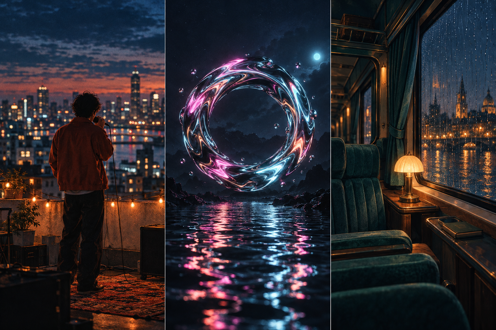

# Guia para criar videoclipes

<!-- LANGUAGES:START -->
<p align="center">🌐 <a href="README.md"><kbd>English</kbd></a> · <a href="README_JA.md"><kbd>日本語</kbd></a> · <a href="README_ID.md"><kbd>Bahasa Indonesia</kbd></a> · <a href="README_IT.md"><kbd>Italiano</kbd></a> · <b>Português</b> · <a href="README_ES.md"><kbd>Español</kbd></a> · <a href="README_DE.md"><kbd>Deutsch</kbd></a> · <a href="README_RU.md"><kbd>Русский</kbd></a> · <a href="README_FR.md"><kbd>Français</kbd></a> · <a href="README_ZH.md"><kbd>简体中文</kbd></a> · <a href="README_TW.md"><kbd>繁體中文</kbd></a> · <a href="README_KO.md"><kbd>한국어</kbd></a> · <a href="README_TH.md"><kbd>ไทย</kbd></a> · <a href="README_VI.md"><kbd>Tiếng Việt</kbd></a> · <a href="README_AR.md"><kbd>العربية</kbd></a></p>
<!-- LANGUAGES:END -->

**Dê à sua música imagens que prendam a atenção até o fim. Explore os exemplos, escolha uma ideia e termine seu primeiro vídeo curto.**

<p align="center"><a href="#x-creators"><kbd>▶ Exemplos no X</kbd></a> &nbsp; <a href="#listen"><kbd>♫ Ouvir MusicMaker</kbd></a> &nbsp; <a href="#first-video"><kbd>✦ Primeiro vídeo</kbd></a> &nbsp; <a href="#next-project"><kbd>→ Próximo exercício</kbd></a></p>

[](#first-video)

Cantor no terraço, formas metálicas e trem noturno na chuva. São imagens conceituais originais, não resultados de geração de vídeo.

<a id="x-creators"></a>

## Exemplos no X

Seis vídeos com prompts ou explicações públicas. Cada imagem abre a publicação original do criador.

<table>
<tr>
<td width="50%" valign="top"><a href="https://x.com/Just_sharon7/status/2083422886686031982"></a><br><b>Mantenha a posição dos dois artistas e alterne planos abertos e fechados.</b><br><sub><a href="https://x.com/Just_sharon7/status/2083422886686031982">@Just_sharon7</a> · Seedance 2.5</sub><br><a href="https://x.com/Just_sharon7/status/2083422886686031982">Publicação original ↗</a> · <a href="docs/x-cases.md#duo">Proposta · inglês →</a></td>
<td width="50%" valign="top"><a href="https://x.com/techhalla/status/2086915118307119269"></a><br><b>Prepare separadamente a referência do personagem e o áudio cantado.</b><br><sub><a href="https://x.com/techhalla/status/2086915118307119269">@techhalla</a> · MiniMax H3 + Seedream 5 Pro</sub><br><a href="https://x.com/techhalla/status/2086915118307119269">Publicação original ↗</a> · <a href="docs/x-cases.md#h3-performance">Proposta · inglês →</a></td>
</tr>
<tr>
<td width="50%" valign="top"><a href="https://x.com/AIwithkhan/status/2087754389624860911"></a><br><b>Use a mesma referência do personagem para conectar cenários diferentes.</b><br><sub><a href="https://x.com/AIwithkhan/status/2087754389624860911">@AIwithkhan</a> · Seedance 2.5</sub><br><a href="https://x.com/AIwithkhan/status/2087754389624860911">Publicação original ↗</a> · <a href="docs/x-cases.md#y2k">Proposta · inglês →</a></td>
<td width="50%" valign="top"><a href="https://x.com/oggii_0/status/2041392542659584302"></a><br><b>Transforme uma forma continuamente: motion design que pode inspirar visuais musicais.</b><br><sub><a href="https://x.com/oggii_0/status/2041392542659584302">@oggii_0</a> · Seedance 2.0</sub><br><a href="https://x.com/oggii_0/status/2041392542659584302">Publicação original ↗</a> · <a href="docs/x-cases.md#motion-design">Proposta · inglês →</a></td>
</tr>
<tr>
<td width="50%" valign="top"><a href="https://x.com/Strength04_X/status/2098290630179057858"></a><br><b>Conecte partida, transformação e chegada. A fonte é um curta de fantasia.</b><br><sub><a href="https://x.com/Strength04_X/status/2098290630179057858">@Strength04_X</a> · Seedance 2.5</sub><br><a href="https://x.com/Strength04_X/status/2098290630179057858">Publicação original ↗</a> · <a href="docs/x-cases.md#lunar-train">Proposta · inglês →</a></td>
<td width="50%" valign="top"><a href="https://x.com/Strength04_X/status/2090399966988550435"></a><br><b>Deixe uma pausa breve e revele a mudança no tempo forte.</b><br><sub><a href="https://x.com/Strength04_X/status/2090399966988550435">@Strength04_X</a> · Seedance 2.5</sub><br><a href="https://x.com/Strength04_X/status/2090399966988550435">Publicação original ↗</a> · <a href="docs/x-cases.md#beat-drop">Proposta · inglês →</a></td>
</tr>
</table>

Os nomes dos modelos foram informados pelos autores. Texto e mídia foram conferidos em um espelho público do X; não reproduzimos os vídeos. As análises detalhadas estão em inglês.

<a id="listen"></a>

## Ouvir MusicMaker

Seis músicas em duas colunas e três linhas. As quatro primeiras capas sugerem ideias visuais; as duas últimas também têm descrições de arranjo publicadas pela fonte. Clique para ouvir.

<!-- LISTENING-GRID:START -->
<table>
<tr>
<td width="50%" valign="top"><a href="https://musicmaker.im/detail/discover-v2-94/"></a><br><b>Neon Pulse</b><br>Capa: palco de neon<br><a href="https://musicmaker.im/detail/discover-v2-94/"><kbd>▶ Ouvir música</kbd></a></td>
<td width="50%" valign="top"><a href="https://musicmaker.im/detail/discover-v2-95/"></a><br><b>Echoes of You</b><br>Capa: piano à janela<br><a href="https://musicmaker.im/detail/discover-v2-95/"><kbd>▶ Ouvir música</kbd></a></td>
</tr>
<tr>
<td width="50%" valign="top"><a href="https://musicmaker.im/detail/discover-v2-104/"></a><br><b>The Open Road</b><br>Capa: estrada aberta<br><a href="https://musicmaker.im/detail/discover-v2-104/"><kbd>▶ Ouvir música</kbd></a></td>
<td width="50%" valign="top"><a href="https://musicmaker.im/detail/discover-v2-96/"></a><br><b>Summer High</b><br>Capa: litoral no verão<br><a href="https://musicmaker.im/detail/discover-v2-96/"><kbd>▶ Ouvir música</kbd></a></td>
</tr>
<tr>
<td width="50%" valign="top"><a href="https://musicmaker.im/detail/discover-v2-108/"></a><br><b>It Takes Another Shape</b><br>Fonte: compasso 6/8, violão, piano e violoncelo<br><a href="https://musicmaker.im/detail/discover-v2-108/"><kbd>▶ Ouvir música</kbd></a></td>
<td width="50%" valign="top"><a href="https://musicmaker.im/detail/discover-v2-106/"></a><br><b>Morning with Healing Hands</b><br>Fonte: violão, contrabaixo, cordas e voz masculina<br><a href="https://musicmaker.im/detail/discover-v2-106/"><kbd>▶ Ouvir música</kbd></a></td>
</tr>
</table>
<!-- LISTENING-GRID:END -->

<a id="first-video"></a>

## Crie seu primeiro vídeo

Use a capa de The Open Road como ponto de partida para uma viagem de 16 segundos. Os passos abaixo são para a estrada. Para Summer High, abra a proposta do litoral no cartão.

<table>
<tr>
<td width="50%" valign="top"><a href="https://musicmaker.im/detail/discover-v2-104/"></a><br><b>The Open Road</b><br>Capa: estrada aberta<br><a href="docs/brand-projects.md#the_open_road"><kbd>→ Proposta · inglês</kbd></a></td>
<td width="50%" valign="top"><a href="https://musicmaker.im/detail/discover-v2-96/"></a><br><b>Summer High</b><br>Capa: litoral no verão<br><a href="docs/brand-projects.md#summer_high"><kbd>→ Proposta · inglês</kbd></a></td>
</tr>
</table>

[♫ Base de prática](starter-kit/practice-beat-120bpm.wav) · [↗ Ferramenta oficial](https://hailuoai.video/tools/minimax-h3) · [↗ MusicMaker](https://musicmaker.im/free-short-music-video-generator/)

1. Escolha um trecho completo de 16 segundos de uma música sua ou use a base original de prática. No GitHub, clique em Download raw file. Ouvir uma faixa não dá permissão para reutilizar a gravação.
2. Para texto, copie os prompts abaixo. Com imagens, o H3 oficial oferece quadro inicial ou referências; o MusicMaker precisa de uma imagem inicial e uma final para cada plano.
3. Escolha Hailuo H3 oficial ou MusicMaker, no formato 9:16. No H3 selecione 5 segundos; a página de clipes do MusicMaker informa atualmente 5 segundos e 480p. Confira o primeiro resultado antes de continuar.
4. Corte os quatro clipes para 4 segundos cada e posicione-os em 0, 4, 8 e 12 segundos. Silencie o áudio deles e mantenha a música. Ajuste os cortes quando trocar de faixa.
5. Adicione o título no editor, exporte em MP4 e reproduza o arquivo. Verifique quadros pretos, áudio duplicado e finais abruptos.

- **00–04s** · Mapa e óculos no carro estacionado
- **04–08s** · Estrada entre campos vista do carro
- **08–12s** · Campos dourados pela janela lateral
- **12–16s** · Vista do destino com título

<details>
<summary><b>Abrir quatro prompts. Use um por geração.</b></summary>

```text
A: Carro estacionado ao lado de campos dourados, luz quente do dia.
Close fixo de mapa dobrado e óculos no painel.
Interior e objetos imóveis.
Sem pessoas ou texto.
```

```text
B: Do banco dianteiro, estrada entre campos dourados.
Céu azul e luz quente.
Mapa e óculos parados no painel.
Câmera fixa no interior, avanço lento.
Sem bifurcações, pessoas ou texto.
```

```text
C: Pela janela lateral, os mesmos campos dourados passam lentamente para trás.
Céu azul e luz quente.
Câmera fixa, horizonte nivelado.
Sem prédios, pessoas ou texto.
```

```text
D: Mirante aberto na borda de campos dourados.
Céu azul e luz quente.
Plano aberto fixo, grama movida suavemente pelo vento.
Espaço embaixo para o título posterior.
Sem carro, pessoas ou texto.
```

</details>

São prompts novos de prática, ainda não testados em geração, e não registros de produção dos originais. O MusicMaker identifica H3 na página de clipes, mas configurações e cotas diferem entre os serviços.

[→ Passos detalhados · inglês](docs/first-video.md#3-assemble-in-an-editor)

<a id="next-project"></a>

## Aprenda a próxima técnica

Depois da viagem, acrescente uma técnica por vez. As imagens abrem os originais; as propostas levam a passos detalhados em inglês.

<table>
<tr>
<td width="50%" valign="top"><a href="https://musicmaker.im/detail/discover-v2-95/"></a><br><b>Echoes of You</b><br>Conecte janela, flores e tampa do piano para praticar cortes de detalhes.<br><a href="docs/brand-projects.md#echoes_of_you"><kbd>→ Proposta · inglês</kbd></a></td>
<td width="50%" valign="top"><a href="https://musicmaker.im/detail/discover-v2-94/"></a><br><b>Neon Pulse</b><br>Reutilize a referência do personagem e confira rosto, microfone e anel luminoso.<br><a href="docs/brand-projects.md#neon_pulse"><kbd>→ Proposta · inglês</kbd></a></td>
</tr>
<tr>
<td width="50%" valign="top"><a href="https://cdn.musicmaker.im/musicmaker/ai_music_video_generator/example/example1_video.mp4"></a><br><b>Apresentação com guitarra</b><br>Envie seu retrato e um trecho cantado; confira primeiro a boca e depois as mãos.<br><a href="docs/brand-projects.md#performance-1"><kbd>→ Proposta · inglês</kbd></a></td>
<td width="50%" valign="top"><a href="https://cdn.musicmaker.im/musicmaker/ai_music_video_generator/example/example2_video.mp4"></a><br><b>Canto expressivo</b><br>Expresse uma frase com close fixo e movimentos pequenos.<br><a href="docs/brand-projects.md#performance-2"><kbd>→ Proposta · inglês</kbd></a></td>
</tr>
</table>

Para canto, use referências de áudio do H3 oficial ou música e retrato no MusicMaker. As demonstrações vocais do MusicMaker não identificam o modelo. Confira som, boca e dedos e evite áudio duplicado.

[↗ Ferramenta oficial](https://hailuoai.video/tools/minimax-h3) · [↗ MusicMaker](https://musicmaker.im/ai-music-video-generator/) · [→ Passos detalhados · inglês](docs/first-video.md#vocal)

## Fontes oficiais dos modelos

- **[Seedance 2.5](https://seed.bytedance.com/en/seedance2_5)** — Planeje som e imagem juntos; as entradas disponíveis dependem da ferramenta.
- **[MiniMax H3](https://www.minimax.io/blog/minimax-h3)** — Exemplos oficiais atribuem funções distintas a imagem, vídeo e áudio.
- **[MiniMax Music 3.0](https://www.minimax.io/blog/minimax-music-3-0-next-generation-open-weights-production-ready-versatile-music-model)** — Comece pelo conceito e pela letra opcional; defina primeiro a estrutura musical.
- **[Eleven Music](https://elevenlabs.io/docs/overview/capabilities/music/best-practices)** — Descreva gênero, clima, instrumentos e andamento de forma concreta.

[→ Fontes e direitos](assets/README.md) · [MIT](LICENSE)

Mantido por AI Music Maker. Texto, código e base originais: MIT. Música, imagens e vídeos externos pertencem aos respectivos titulares.
