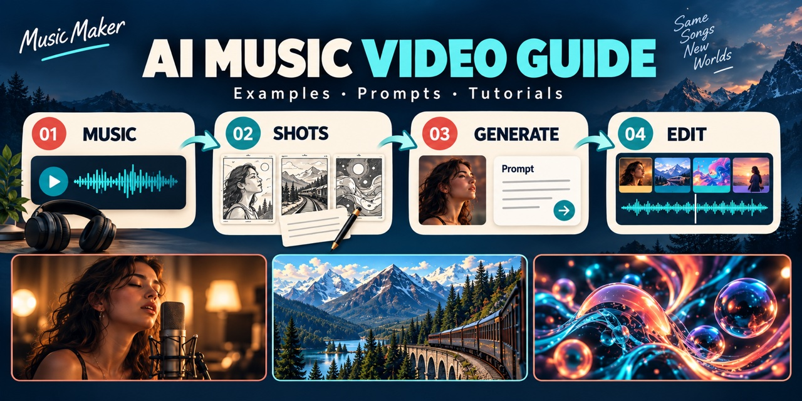

<h1 align="center"><a href="https://musicmaker.im/"></a> AI Music Maker Руководство по созданию музыкальных видео: Промпты, примеры и уроки для начинающих</h1>

<p align="center"><strong>Добавьте к песне кадры, которые хочется досмотреть.</strong></p>

<p align="center">Изучите примеры, выберите идею и закончите своё первое короткое видео.</p>

<!-- LANGUAGES:START -->
<p align="center"><a href="README.md"></a> <a href="README_ZH.md"></a> <a href="README_TW.md"></a> <a href="README_JA.md"></a> <a href="README_KO.md"></a> <a href="README_ID.md"></a> <a href="README_IT.md"></a> <a href="README_PT.md"></a><br>
<a href="README_ES.md"></a> <a href="README_DE.md"></a> <a href="README_RU.md"></a> <a href="README_FR.md"></a> <a href="README_TH.md"></a> <a href="README_VI.md"></a> <a href="README_AR.md"></a></p>
<!-- LANGUAGES:END -->

<!-- DEVICE:START -->
<p align="center"><a href="mobile/README_RU.md"></a></p>
<!-- DEVICE:END -->

<p align="center"><a href="#ai-vs-live"><kbd>◈ ИИ и натурная съёмка</kbd></a> &nbsp; <a href="#official-models"><kbd>✦ Официальные примеры моделей и уроки</kbd></a> &nbsp; <a href="#x-creators"><kbd>▶ Примеры в X</kbd></a> &nbsp; <a href="#listen"><kbd>♫ Слушать MusicMaker</kbd></a> &nbsp; <a href="#first-video"><kbd>✦ Первое видео</kbd></a> &nbsp; <a href="#next-project"><kbd>→ Следующее упражнение</kbd></a> &nbsp; <a href="#toolkit"><kbd>🧰 Бесплатные инструменты</kbd></a></p>

[](#first-video)

Выбрать музыку → спланировать кадры и промпты → создать клипы → смонтировать и экспортировать. Авторская схема процесса с вокалом, путешествием и абстракцией.

<!-- COMPARISON:START -->
<a id="ai-vs-live"></a>

## Два музыкальных клипа: чем отличаются ИИ и натурная съёмка?

Музыка может растянуть секунды в зрелище или пронести перед глазами десятилетия. Посмотрите два официально выпущенных клипа и выберите, какое повествование хотите попробовать.

<table>
<tr>
<td width="50%" valign="top"><b>Визуальный ряд ИИ · Режиссура человека</b><br><a href="https://www.youtube.com/watch?v=-Nb-M1GAOX8"></a><br><b>Washed Out — The Hardest Part</b><br><sub>Режиссура/монтаж: Paul Trillo · 2024 · Изображения Sora</sub><br>Следуйте за камерой сквозь фрагменты жизни пары. Эпохи и места сливаются, словно воспоминания.<br><a href="https://www.youtube.com/watch?v=-Nb-M1GAOX8"><kbd>▶ Смотреть клип целиком</kbd></a> · <a href="https://www.subpop.com/news/2024/05/02/washed_outs_notes_from_a_quiet_life_available_june_28th">Как это снято ↗</a></td>
<td width="50%" valign="top"><b>Живое исполнение · Высокоскоростная съёмка</b><br><a href="https://www.youtube.com/watch?v=QvW61K2s0tA"></a><br><b>OK Go — The One Moment</b><br><sub>Режиссура: Damian Kulash · 2016 · Съёмка, физические эффекты и постобработка</sub><br>Краска, взрывающийся реквизит и группа движутся под музыку. Высокоскоростная съёмка превращает мимолётные действия в зрелище.<br><a href="https://www.youtube.com/watch?v=QvW61K2s0tA"><kbd>▶ Смотреть клип целиком</kbd></a> · <a href="https://okgo.net/2016/11/23/background-notes-and-full-credits-for-the-one-moment-video/">Как это снято ↗</a></td>
</tr>
</table>

<table>
<tr><td width="50%" valign="top"><b>Откуда берутся кадры · Создание с ИИ</b><br>Описать сцены и планы, затем выбрать и собрать сгенерированные клипы.</td><td width="50%" valign="top"><b>Откуда берутся кадры · Натурная съёмка</b><br>Подготовить исполнителей, места и реквизит, затем снять и смонтировать.</td></tr>
<tr><td width="50%" valign="top"><b>Творческая задача · Создание с ИИ</b><br>Пробовать необычные переходы; проверять непрерывность персонажей и деталей.</td><td width="50%" valign="top"><b>Творческая задача · Натурная съёмка</b><br>Репетировать действия, настроить свет и время, затем смонтировать исполнение под музыку.</td></tr>
<tr><td width="50%" valign="top"><b>Что попробовать сначала · Создание с ИИ</b><br>Одним планом провести зрителя между двумя местами.</td><td width="50%" valign="top"><b>Что попробовать сначала · Натурная съёмка</b><br>Совместить чёткое действие с началом припева или сильной долей.</td></tr>
</table>

ИИ позволяет попробовать визуальную идею до постройки целой декорации. Историю, ритм и финальные кадры по-прежнему выбираете вы. Возьмите 10–16 секунд музыки, начните с одного перехода и изучите модели и промпты.

[✦ Перейти к официальным примерам](#official-models) · [Сравнение и источники (English)](docs/ai-vs-live.md)

<!-- COMPARISON:END -->

<!-- OFFICIAL:START -->
<a id="official-models"></a>

## Официальные примеры моделей и уроки

Сначала изучите демонстрации и входные материалы разработчиков, затем работы сообщества.

<table>
<tr>
<td width="50%" valign="top"><a href="https://seed.bytedance.com/en/blog/one-take-creation-flexible-referencing-introducing-seedance-2-5"></a><br><sub>Кадр официальной демонстрации</sub><br><b>Seedance 2.5</b> · ByteDance Seed<br>Концерт: отдельные референсы сцены и исполнителей.<br><a href="https://seed.bytedance.com/en/blog/one-take-creation-flexible-referencing-introducing-seedance-2-5"><kbd>▶ Официальный пример</kbd></a> · <a href="https://seed.bytedance.com/en/blog/one-take-creation-flexible-referencing-introducing-seedance-2-5">Руководство / промпт ↗</a><br><a href="docs/official-cases.md#seedance-concert">Пошаговые заметки · английский →</a> · <a href="https://musicmaker.im/model/seedance-2-5/"><kbd>MusicMaker ↗</kbd></a></td>
<td width="50%" valign="top"><a href="https://www.minimax.io/blog/minimax-h3"></a><br><sub>Официальное входное изображение</sub><br><b>MiniMax H3</b> · MiniMax<br>Пение: разделить камеру, персонажа и голос.<br><a href="https://www.minimax.io/blog/minimax-h3"><kbd>▶ Официальный пример</kbd></a> · <a href="https://hailuoai.video/tools/minimax-h3">Руководство / промпт ↗</a><br><a href="docs/official-cases.md#h3-singing">Пошаговые заметки · английский →</a> · <a href="https://musicmaker.im/model/minimax-h3/"><kbd>MusicMaker ↗</kbd></a></td>
</tr>
<tr>
<td width="50%" valign="top"><a href="https://deepmind.google/models/veo/"></a><br><sub>Официальное сравнение входа и результата</sub><br><b>Veo 3.1</b> · Google DeepMind<br>Сюрреалистическое пение: сочетайте референсы персонажа и окружения.<br><a href="https://deepmind.google/models/veo/"><kbd>▶ Официальный пример</kbd></a> · <a href="https://deepmind.google/models/veo/prompt-guide/">Руководство / промпт ↗</a><br><a href="docs/official-cases.md#veo-scene">Пошаговые заметки · английский →</a> · <a href="https://musicmaker.im/model/veo-3-1-ai/"><kbd>MusicMaker ↗</kbd></a></td>
<td width="50%" valign="top"><a href="https://seed.bytedance.com/en/seedance2_0"></a><br><sub>Обложка официального видео</sub><br><b>Seedance 2.0</b> · ByteDance Seed<br>Фортепиано: от среднего плана к крупному плану лица.<br><a href="https://seed.bytedance.com/en/seedance2_0"><kbd>▶ Официальный пример</kbd></a> · <a href="https://seed.bytedance.com/en/seedance2_0">Руководство / промпт ↗</a><br><a href="docs/official-cases.md#seedance-piano">Пошаговые заметки · английский →</a> · <a href="https://musicmaker.im/model/seedance-2-0/"><kbd>MusicMaker ↗</kbd></a></td>
</tr>
</table>

<!-- OFFICIAL:END -->

<a id="x-creators"></a>

## Примеры в X

Шесть видео с открытыми промптами или пояснениями. Нажмите на изображение, чтобы открыть исходный пост автора.

<table>
<tr>
<td width="50%" valign="top"><a href="https://x.com/Just_sharon7/status/2083422886686031982"></a><br><b>Закрепите позиции двух исполнителей и чередуйте общие и крупные планы.</b><br><sub><a href="https://x.com/Just_sharon7/status/2083422886686031982">@Just_sharon7</a> · Seedance 2.5</sub><br><a href="https://x.com/Just_sharon7/status/2083422886686031982">Исходный пост ↗</a> · <a href="docs/x-cases.md#duo">Проект · английский →</a></td>
<td width="50%" valign="top"><a href="https://x.com/techhalla/status/2086915118307119269"></a><br><b>Подготовьте отдельно референс персонажа и запись вокала.</b><br><sub><a href="https://x.com/techhalla/status/2086915118307119269">@techhalla</a> · MiniMax H3 + Seedream 5 Pro</sub><br><a href="https://x.com/techhalla/status/2086915118307119269">Исходный пост ↗</a> · <a href="docs/x-cases.md#h3-performance">Проект · английский →</a></td>
</tr>
<tr>
<td width="50%" valign="top"><a href="https://x.com/AIwithkhan/status/2087754389624860911"></a><br><b>Свяжите разные локации одним референсом персонажа.</b><br><sub><a href="https://x.com/AIwithkhan/status/2087754389624860911">@AIwithkhan</a> · Seedance 2.5</sub><br><a href="https://x.com/AIwithkhan/status/2087754389624860911">Исходный пост ↗</a> · <a href="docs/x-cases.md#y2k">Проект · английский →</a></td>
<td width="50%" valign="top"><a href="https://x.com/oggii_0/status/2041392542659584302"></a><br><b>Плавно меняйте одну форму: пример моушн-дизайна для музыкальных визуализаций.</b><br><sub><a href="https://x.com/oggii_0/status/2041392542659584302">@oggii_0</a> · Seedance 2.0</sub><br><a href="https://x.com/oggii_0/status/2041392542659584302">Исходный пост ↗</a> · <a href="docs/x-cases.md#motion-design">Проект · английский →</a></td>
</tr>
<tr>
<td width="50%" valign="top"><a href="https://x.com/Strength04_X/status/2098290630179057858"></a><br><b>Соедините отправление, превращение и прибытие. Источник — фантастическая короткометражка.</b><br><sub><a href="https://x.com/Strength04_X/status/2098290630179057858">@Strength04_X</a> · Seedance 2.5</sub><br><a href="https://x.com/Strength04_X/status/2098290630179057858">Исходный пост ↗</a> · <a href="docs/x-cases.md#lunar-train">Проект · английский →</a></td>
<td width="50%" valign="top"><a href="https://x.com/Strength04_X/status/2090399966988550435"></a><br><b>Оставьте небольшую паузу и покажите смену сцены на сильную долю.</b><br><sub><a href="https://x.com/Strength04_X/status/2090399966988550435">@Strength04_X</a> · Seedance 2.5</sub><br><a href="https://x.com/Strength04_X/status/2090399966988550435">Исходный пост ↗</a> · <a href="docs/x-cases.md#beat-drop">Проект · английский →</a></td>
</tr>
</table>

<a id="listen"></a>

## Слушать MusicMaker

Девять контрастов в трёх рядах: фортепиано, рок, оркестр и танцевальная музыка. Сравните плотность звука и ритм. Жанры взяты из поля Style.

<!-- LISTENING-GRID:START -->
<table>
<tr>
<td width="33%" valign="top"><a href="https://musicmaker.im/detail/discover-v2-21/"></a><br><b>Sleeptown Windowlight</b><br><b>Соло фортепиано</b><br><sub>длинные планы</sub><br><a href="https://musicmaker.im/detail/discover-v2-21/"><kbd>▶ Слушать песню</kbd></a></td>
<td width="33%" valign="top"><a href="https://musicmaker.im/detail/discover-v2-52/"></a><br><b>Voltage In My Veins</b><br><b>Современный рок</b><br><sub>резкие склейки</sub><br><a href="https://musicmaker.im/detail/discover-v2-52/"><kbd>▶ Слушать песню</kbd></a></td>
<td width="33%" valign="top"><a href="https://musicmaker.im/detail/discover-v2-24/"></a><br><b>Crown of the Tempest</b><br><b>Эпический оркестр</b><br><sub>просторные сцены</sub><br><a href="https://musicmaker.im/detail/discover-v2-24/"><kbd>▶ Слушать песню</kbd></a></td>
</tr>
<tr>
<td width="33%" valign="top"><a href="https://musicmaker.im/detail/discover-v2-87/"></a><br><b>Rain On Beale</b><br><b>Лоу-фай-джаз</b><br><sub>дождевой цикл</sub><br><a href="https://musicmaker.im/detail/discover-v2-87/"><kbd>▶ Слушать песню</kbd></a></td>
<td width="33%" valign="top"><a href="https://musicmaker.im/detail/discover-v2-42/"></a><br><b>Tidal Release</b><br><b>Прогрессив-хаус</b><br><sub>нарастание и смена</sub><br><a href="https://musicmaker.im/detail/discover-v2-42/"><kbd>▶ Слушать песню</kbd></a></td>
<td width="33%" valign="top"><a href="https://musicmaker.im/detail/discover-v2-48/"></a><br><b>Back Roads Lead Me Home</b><br><b>Кантри-баллада</b><br><sub>тёплая история</sub><br><a href="https://musicmaker.im/detail/discover-v2-48/"><kbd>▶ Слушать песню</kbd></a></td>
</tr>
<tr>
<td width="33%" valign="top"><a href="https://musicmaker.im/detail/discover-v2-22/"></a><br><b>Midnight Garden Circuits</b><br><b>Эмбиент-электроника</b><br><sub>абстракция</sub><br><a href="https://musicmaker.im/detail/discover-v2-22/"><kbd>▶ Слушать песню</kbd></a></td>
<td width="33%" valign="top"><a href="https://musicmaker.im/detail/discover-v2-60/"></a><br><b>Basement Crown</b><br><b>Хип-хоп</b><br><sub>чёткие склейки</sub><br><a href="https://musicmaker.im/detail/discover-v2-60/"><kbd>▶ Слушать песню</kbd></a></td>
<td width="33%" valign="top"><a href="https://musicmaker.im/detail/discover-v2-90/"></a><br><b>Keep It Open</b><br><b>Электронный R&amp;B</b><br><sub>эмоции крупным планом</sub><br><a href="https://musicmaker.im/detail/discover-v2-90/"><kbd>▶ Слушать песню</kbd></a></td>
</tr>
</table>
<!-- LISTENING-GRID:END -->

Понравился звук? Сначала создайте обложку и короткую сцену. Выбирайте инструмент под следующий шаг. [→ Бесплатные инструменты](#toolkit) · [↗ Стили и источники · английский](docs/listening-notes.md)

<a id="first-video"></a>

## Создайте первое видео

<table><tr><td width="42%" valign="top"><a href="https://musicmaker.im/detail/discover-v2-98/"></a></td><td width="58%" valign="top">Обложка Living on the Brightside вдохновляет на 16 секунд природы: радуга, ручей и цветы.<br><br><b>1.</b> Выберите 16 секунд собственной или разрешённой музыки. Учебный трек скачивается через Download raw file. Отметьте в редакторе 0, 4, 8, 12 и 16 секунд; для другой песни подстройте склейки под ритм и фразы.</td></tr></table>

[▶ Слушать песню](https://musicmaker.im/detail/discover-v2-98/) · [↗ Официальный инструмент](https://hailuoai.video/tools/minimax-h3) · [↗ MusicMaker](https://musicmaker.im/free-short-music-video-generator/)

[♫ Учебная фонограмма](starter-kit/practice-beat-120bpm.wav)

2. В официальном Hailuo выберите H3 и генерацию по тексту либо используйте короткие клипы MusicMaker. Формат 9:16, по пять секунд. MusicMaker сейчас указывает 480p и использование H3.

3. Сначала проверьте A с цветами, затем создайте B с ручьём, C с радугой и D для финала. Копируйте английские промпты отдельно. Для режима с изображениями в MusicMaker нужны ваши разрешённые начальный и конечный кадры.

4. Оставьте по четыре стабильные секунды и соедините прямыми склейками. Выключите сгенерированный звук, сохранив одну музыкальную дорожку. Добавьте название в последние две секунды и короткое затухание музыки.

5. Экспортируйте MP4 9:16. Проверьте чёрные кадры, течение воды и деформации. Увеличение 480p не добавляет деталей. Уменьшите движение или используйте одно разрешённое изображение, если пейзаж сильно меняется.

**Английские промпты для копирования**

```text
A: A green valley after rain, soft afternoon sunlight.
Close-up of purple wildflowers with water droplets beside a shallow stream.
Locked camera; a light breeze moves only the flower stems. Soft grassy background.
Natural photographic realism. No people, buildings or text; keep flower count stable.
```

```text
B: The same green valley after rain in soft afternoon sunlight.
Medium view of a shallow stream flowing between grassy slopes toward the foreground.
Locked camera; water moves slowly over stones, purple flowers sway subtly.
Keep the riverbanks stable. No people, buildings or text.
```

```text
C: Wide view of a green valley after rain in soft afternoon sunlight.
One rainbow spans the distant sky; a shallow stream and purple flowers fill the foreground.
Locked wide camera; grass moves subtly and clouds drift slowly.
Keep the rainbow stationary. No extra rainbows, people, buildings, text or fast camera moves.
```

```text
D: A distant view of the same green valley after rain, soft afternoon sunlight.
A shallow stream leads toward one rainbow. Locked camera; only water and grass move subtly.
Leave clean grass in the lower frame for a title added later.
Keep terrain and rainbow stable. No people, buildings or generated text.
```

Сохраняйте освещение и рельеф; музыка и изображение заканчиваются вместе.

[→ Инструкция · английский](docs/first-video.md#3-assemble-in-an-editor)

<a id="next-project"></a>

## Освойте следующий приём

<table><tr><td width="42%" valign="top"><a href="https://cdn.musicmaker.im/musicmaker/ai_music_video_generator/example/example2_video.mp4"></a></td><td width="58%" valign="top">Теперь около десяти секунд вокального крупного плана. Изображение — входной портрет из примера MusicMaker; нажатие открывает видео.<br><br><b>1.</b> Подготовьте разрешённый портрет почти анфас с видимыми губами и собственную или разрешённую вокальную фразу. Оставьте около десяти секунд с небольшим запасом для дыхания. Инструментальный учебный трек не заменяет вокал.</td></tr></table>

[▶ Смотреть пример MusicMaker](https://cdn.musicmaker.im/musicmaker/ai_music_video_generator/example/example2_video.mp4) · [↗ Официальный инструмент](https://hailuoai.video/tools/minimax-h3) · [↗ MusicMaker](https://musicmaker.im/ai-music-video-generator/)

2. В H3 Omni Reference добавьте портрет и вокал в Refs. Выберите около десяти секунд и подходящий формат. Аудиореференс нужно сочетать с изображением или видео.

3. В MusicMaker поместите вокал в Music File, портрет в Character Image, инструкцию ниже в Prompt. Перед Generate проверьте отрезок, оценку расхода и переключатель Public.

4. Начните с неподвижной камеры. Сравните губы и звук в начале, середине и конце. Постоянное смещение можно поправить монтажом; растущее требует более короткой фразы или новой генерации. При изменении лица уменьшите кивки.

5. Оставьте исходный вокал либо сгенерированный звук, удалив дублирующую дорожку. Добавьте название, экспортируйте MP4 и проверьте целую фразу с дыханием в конце. Лишь затем пробуйте медленное приближение.

**Английские промпты для копирования**

```text
Use my uploaded portrait as the only character reference and my uploaded vocal as the timing guide.
Keep the same adult singer, face, hairstyle, clothes and lighting as in the supplied portrait.
Locked shoulder-up close-up. Keep the microphone below and beside the lips, never covering them.
Hands stay outside the frame. Perform the supplied phrase with natural matching mouth movements,
subtle breathing, blinking and a slight nod. Hold the pose through sustained notes.
Relax naturally after the phrase. Do not add dialogue or change lyrics.
No costume change, turning around, cuts, additional people, text or exaggerated expressions.
```

Один человек, видимые губы, одна звуковая дорожка, естественный финал.

[→ Инструкция · английский](docs/first-video.md#vocal)

<a id="toolkit"></a>

## Начните бесплатно: инструменты для творчества

Первые четыре строки содержат инструменты, заявленные как бесплатные; пятая — справочные материалы. Лимиты, вход и очереди проверяйте на текущих страницах. Создание песен и анимация пения могут требовать кредитов или оплаты. Просмотр открытого материала не даёт права повторного использования.

<table>
<tr><td width="35%"><b>🖼 Обложки и раскадровки</b></td><td><a href="https://musicmaker.im/free-chatgpt-images-2-5/"><kbd>↗ Free image generator</kbd></a></td></tr>
<tr><td width="35%"><b>🎬 Короткие клипы</b></td><td><a href="https://musicmaker.im/free-short-music-video-generator/"><kbd>↗ 5s short video</kbd></a> · <a href="https://musicmaker.im/free-text-to-video/"><kbd>↗ Text to video</kbd></a></td></tr>
<tr><td width="35%"><b>🎧 Изменение фактуры звука</b></td><td><a href="https://musicmaker.im/lofi-song-maker/"><kbd>↗ Lo-fi song maker</kbd></a></td></tr>
<tr><td width="35%"><b>📦 Форматы и данные песни</b></td><td><a href="https://musicmaker.im/audio-converter/mp3-to-wav/"><kbd>↗ MP3 → WAV</kbd></a> · <a href="https://musicmaker.im/mp3-tag-editor-online/"><kbd>↗ MP3 tag editor</kbd></a></td></tr>
<tr><td width="35%"><b>📚 Материалы и промпты</b></td><td><a href="https://musicmaker.im/discover/"><kbd>↗ Discover</kbd></a> · <a href="https://musicmaker.im/ai-music-video-generator/"><kbd>↗ Video examples</kbd></a> · <a href="prompts/README.md"><kbd>↗ 12 prompts</kbd></a></td></tr>
</table>

[→ Все ресурсы и инструменты · английский](docs/brand-resources.md)

## Выбор модели: официальные материалы и MusicMaker

<!-- CAPABILITIES:START -->
<table>
<tr><td width="650"><b>Seedance 2.5</b><br>Наши рекомендации для практики: Текст или изображения → планирование нескольких планов. В MusicMaker могут быть доступны не все функции референсов разработчика.</td><td width="350"><a href="https://seed.bytedance.com/en/blog/one-take-creation-flexible-referencing-introducing-seedance-2-5">Руководство / промпт ↗</a><br><a href="docs/official-cases.md#seedance-concert">Пошаговые заметки · английский →</a><br><a href="https://musicmaker.im/model/seedance-2-5/"><kbd>MusicMaker · Seedance 2.5 ↗</kbd></a></td></tr>
<tr><td width="650"><b>MiniMax H3</b><br>Наши рекомендации для практики: Клипы по тексту/изображению и вокальные референсы — разные пути. MusicMaker: Бесплатный вход предлагает 5 с при 480p; аудиозапись пения нельзя поместить в текстовое поле.</td><td width="350"><a href="https://hailuoai.video/tools/minimax-h3">Руководство / промпт ↗</a><br><a href="docs/official-cases.md#h3-singing">Пошаговые заметки · английский →</a><br><a href="https://musicmaker.im/model/minimax-h3/"><kbd>MusicMaker · MiniMax H3 ↗</kbd></a></td></tr>
<tr><td width="650"><b>Veo 3.1</b><br>Наши рекомендации для практики: Текст или первый кадр → короткая сцена. Сначала проверьте версию Fast или обычную; не предполагается, что MusicMaker поддерживает несколько референсных изображений.</td><td width="350"><a href="https://deepmind.google/models/veo/prompt-guide/">Руководство / промпт ↗</a><br><a href="docs/official-cases.md#veo-scene">Пошаговые заметки · английский →</a><br><a href="https://musicmaker.im/model/veo-3-1-ai/"><kbd>MusicMaker · Veo 3.1 ↗</kbd></a></td></tr>
<tr><td width="650"><b>Seedance 2.0</b><br>Наши рекомендации для практики: Текст или изображения → кадр с одним исполнителем. Проверьте непрерывность рук и инструмента; точное воспроизведение каждой ноты не гарантируется.</td><td width="350"><a href="https://seed.bytedance.com/en/seedance2_0">Руководство / промпт ↗</a><br><a href="docs/official-cases.md#seedance-piano">Пошаговые заметки · английский →</a><br><a href="https://musicmaker.im/model/seedance-2-0/"><kbd>MusicMaker · Seedance 2.0 ↗</kbd></a></td></tr>
</table>
<!-- CAPABILITIES:END -->

- **[MiniMax Music 3.0](https://www.minimax.io/blog/minimax-music-3-0-next-generation-open-weights-production-ready-versatile-music-model)** — Начните с идеи и необязательного текста песни; сначала определите музыкальную структуру. [MusicMaker ↗](https://musicmaker.im/minimax/minimax-music-v3-0/)
- **[Eleven Music](https://elevenlabs.io/docs/overview/capabilities/music/best-practices)** — Конкретно опишите жанр, настроение, инструменты и темп. [MusicMaker ↗](https://musicmaker.im/eleven-labs/eleven-labs-music/)

[→ Источники и права](assets/README.md) · [MIT](LICENSE)

Поддерживается AI Music Maker. Оригинальные тексты, код и учебная музыка: MIT. Внешняя музыка, изображения и видео принадлежат правообладателям.

<!-- AFFILIATE:START -->
**Партнёрская программа**

MusicMaker приглашает к партнёрскому продвижению. Рассказывайте о наших инструментах создания музыки в уроках, обзорах и сообществах и получайте комиссию за покупки по вашим рекомендациям, соответствующие правилам программы.

<a href="https://musicmaker.im/affiliate-program/"><kbd>↗ Узнать условия и подать заявку</kbd></a>
<!-- AFFILIATE:END -->

<!-- TRUST:START -->
<details>
<summary>Редакционная политика</summary>

Руководство ведёт команда MusicMaker, отдавая приоритет моделям, доступным у бренда. В рекомендательные ссылки не добавлены партнёрские параметры этого репозитория; это не означает отсутствия коммерческих интересов. [ Редакционная политика (English) → ](docs/editorial-policy.md)

Наш собственный 16-секундный пример монтажа готов. Для внешних примеров проверены лишь открытые источники и доступность. Оба урока по генерации с ИИ ещё не проверены на практике от начала до конца.

Сравниваются ИИ-изображения в The Hardest Part группы Washed Out (2024) и натурная съёмка с постобработкой в The One Moment группы OK Go (2016). В обоих случаях работают люди. ИИ обозначает создание изображения, а не авторство песни. Это редакционное сравнение произведений и методов, не контролируемый тест и не доказательство преимуществ в цене, скорости или общем качестве. Sora указан только как инструмент производства того времени.

Это не наши тесты генерации и не рейтинг.

Для всех четырёх версий есть страницы MusicMaker. Примеры и руководства взяты у разработчиков; функции MusicMaker могут отличаться. Изображение H3 — входной материал.

Обложка главной страницы — оригинальная концептуальная иллюстрация. Изображения Discover — обложки песен, а урок по вокалу использует входной портрет из демонстрации бренда. Эти изображения не подтверждают результаты нашей видеогенерации.

Названия моделей в примерах X приведены со слов авторов. Посты и вложения проверены через публичные зеркала, но видео не создавались заново. Производственные промпты остаются в оригинальных постах. [Примечания об источниках · английский](docs/x-cases.md#source-notes).

Идеи видео в разделе прослушивания предложены этим репозиторием. Уроки о природе и пении — новые упражнения, а не записи производства оригиналов. MusicMaker не раскрыл модель опубликованной вокальной демонстрации. Оба набора промптов не проверены на практике от начала до конца и не гарантируют воспроизведения обложки, сохранения исходного звука или точной синхронизации губ.

Публичное прослушивание и просмотр не дают прав на повторное использование. Внешние музыка, изображения и видео требуют соответствующего разрешения.

[▶ Посмотреть наш монтаж](starter-kit/night-train-edit-demo.mp4) · [Подтверждения и статус тестов (EN / 简体中文)](docs/generation-tests.md) · [Сообщить об ошибке](https://github.com/aimusicmaker/awesome-music-video-creator-guide/issues/new/choose)

</details>
<!-- TRUST:END -->

<!-- TRANSLATION:START -->
Тексты и переводы подготовлены с помощью ИИ. Независимая проверка носителями языка не зафиксирована. Подробные материалы доступны на английском и упрощённом китайском. [🌐 Языки и статус проверки (English)](i18n/README.md)
<!-- TRANSLATION:END -->
