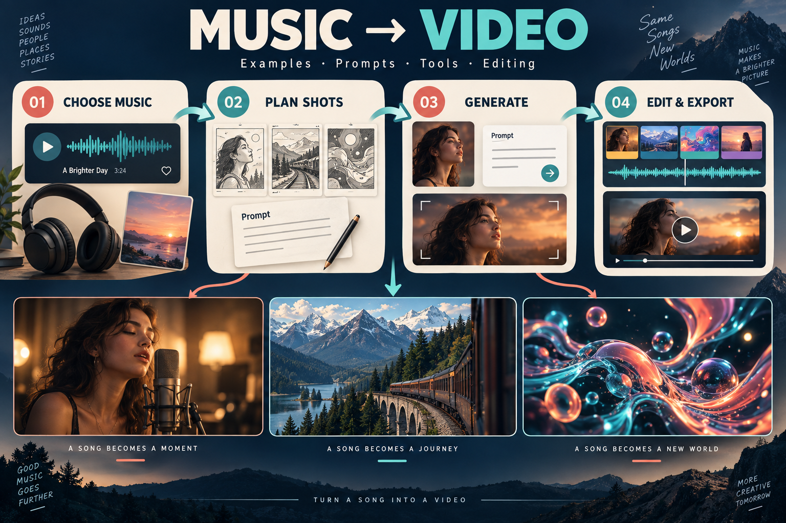

# Hướng dẫn làm video âm nhạc

<!-- LANGUAGES:START -->
<p align="center">🌐 <a href="README.md"><kbd>English</kbd></a> · <a href="README_JA.md"><kbd>日本語</kbd></a> · <a href="README_ID.md"><kbd>Bahasa Indonesia</kbd></a> · <a href="README_IT.md"><kbd>Italiano</kbd></a> · <a href="README_PT.md"><kbd>Português</kbd></a> · <a href="README_ES.md"><kbd>Español</kbd></a> · <a href="README_DE.md"><kbd>Deutsch</kbd></a> · <a href="README_RU.md"><kbd>Русский</kbd></a> · <a href="README_FR.md"><kbd>Français</kbd></a> · <a href="README_ZH.md"><kbd>简体中文</kbd></a> · <a href="README_TW.md"><kbd>繁體中文</kbd></a> · <a href="README_KO.md"><kbd>한국어</kbd></a> · <a href="README_TH.md"><kbd>ไทย</kbd></a> · <b>Tiếng Việt</b> · <a href="README_AR.md"><kbd>العربية</kbd></a></p>
<!-- LANGUAGES:END -->

**Biến một bài hát thành những hình ảnh đáng xem đến cuối. Xem ví dụ, chọn một ý tưởng và hoàn thành video ngắn đầu tiên của bạn.**

<p align="center"><a href="#x-creators"><kbd>▶ Ví dụ trên X</kbd></a> &nbsp; <a href="#listen"><kbd>♫ Nghe MusicMaker</kbd></a> &nbsp; <a href="#first-video"><kbd>✦ Video đầu tiên</kbd></a> &nbsp; <a href="#next-project"><kbd>→ Bài tập tiếp theo</kbd></a></p>

[](#first-video)

Chọn nhạc → lên cảnh và câu lệnh → tạo đoạn phim → dựng và xuất. Hình minh họa quy trình gốc với ca hát, hành trình và hình ảnh trừu tượng, không phải bằng chứng video đã tạo.

<a id="x-creators"></a>

## Ví dụ trên X

Sáu video có câu lệnh hoặc hướng dẫn công khai. Bấm vào hình để xem bài đăng gốc của tác giả.

<table>
<tr>
<td width="50%" valign="top"><a href="https://x.com/Just_sharon7/status/2083422886686031982"></a><br><b>Giữ vị trí hai người biểu diễn rồi xen kẽ toàn cảnh và cận cảnh.</b><br><sub><a href="https://x.com/Just_sharon7/status/2083422886686031982">@Just_sharon7</a> · Seedance 2.5</sub><br><a href="https://x.com/Just_sharon7/status/2083422886686031982">Bài gốc ↗</a> · <a href="docs/x-cases.md#duo">Đề án · tiếng Anh →</a></td>
<td width="50%" valign="top"><a href="https://x.com/techhalla/status/2086915118307119269"></a><br><b>Chuẩn bị riêng hình nhân vật và âm thanh giọng hát.</b><br><sub><a href="https://x.com/techhalla/status/2086915118307119269">@techhalla</a> · MiniMax H3 + Seedream 5 Pro</sub><br><a href="https://x.com/techhalla/status/2086915118307119269">Bài gốc ↗</a> · <a href="docs/x-cases.md#h3-performance">Đề án · tiếng Anh →</a></td>
</tr>
<tr>
<td width="50%" valign="top"><a href="https://x.com/AIwithkhan/status/2087754389624860911"></a><br><b>Dùng cùng một hình tham chiếu nhân vật để nối các bối cảnh.</b><br><sub><a href="https://x.com/AIwithkhan/status/2087754389624860911">@AIwithkhan</a> · Seedance 2.5</sub><br><a href="https://x.com/AIwithkhan/status/2087754389624860911">Bài gốc ↗</a> · <a href="docs/x-cases.md#y2k">Đề án · tiếng Anh →</a></td>
<td width="50%" valign="top"><a href="https://x.com/oggii_0/status/2041392542659584302"></a><br><b>Biến đổi liên tục một hình khối: đồ họa chuyển động có thể áp dụng cho âm nhạc.</b><br><sub><a href="https://x.com/oggii_0/status/2041392542659584302">@oggii_0</a> · Seedance 2.0</sub><br><a href="https://x.com/oggii_0/status/2041392542659584302">Bài gốc ↗</a> · <a href="docs/x-cases.md#motion-design">Đề án · tiếng Anh →</a></td>
</tr>
<tr>
<td width="50%" valign="top"><a href="https://x.com/Strength04_X/status/2098290630179057858"></a><br><b>Nối khởi hành, biến đổi và đến nơi. Bản gốc là phim ngắn kỳ ảo.</b><br><sub><a href="https://x.com/Strength04_X/status/2098290630179057858">@Strength04_X</a> · Seedance 2.5</sub><br><a href="https://x.com/Strength04_X/status/2098290630179057858">Bài gốc ↗</a> · <a href="docs/x-cases.md#lunar-train">Đề án · tiếng Anh →</a></td>
<td width="50%" valign="top"><a href="https://x.com/Strength04_X/status/2090399966988550435"></a><br><b>Chừa một khoảng lặng ngắn rồi hé lộ thay đổi ở nhịp mạnh.</b><br><sub><a href="https://x.com/Strength04_X/status/2090399966988550435">@Strength04_X</a> · Seedance 2.5</sub><br><a href="https://x.com/Strength04_X/status/2090399966988550435">Bài gốc ↗</a> · <a href="docs/x-cases.md#beat-drop">Đề án · tiếng Anh →</a></td>
</tr>
</table>

Tên mô hình do tác giả công bố. Nội dung và tư liệu được kiểm tra qua bản sao công khai của X; chúng tôi chưa tái tạo các video. Phân tích chi tiết bằng tiếng Anh.

<a id="listen"></a>

## Nghe MusicMaker

Chín bài hát trong ba cột, ba hàng. So sánh ý tưởng bìa và mô tả phối khí từ nguồn. Hai bài hướng dẫn bên dưới dùng ví dụ khác.

<!-- LISTENING-GRID:START -->
<table>
<tr>
<td width="33%" valign="top"><a href="https://musicmaker.im/detail/discover-v2-94/"></a><br><b>Neon Pulse</b><br>Ý tưởng ảnh bìa: sân khấu neon<br><a href="https://musicmaker.im/detail/discover-v2-94/"><kbd>▶ Nghe bài hát</kbd></a></td>
<td width="33%" valign="top"><a href="https://musicmaker.im/detail/discover-v2-95/"></a><br><b>Echoes of You</b><br>Ý tưởng ảnh bìa: đàn piano bên cửa sổ<br><a href="https://musicmaker.im/detail/discover-v2-95/"><kbd>▶ Nghe bài hát</kbd></a></td>
<td width="33%" valign="top"><a href="https://musicmaker.im/detail/discover-v2-104/"></a><br><b>The Open Road</b><br>Ý tưởng ảnh bìa: con đường rộng mở<br><a href="https://musicmaker.im/detail/discover-v2-104/"><kbd>▶ Nghe bài hát</kbd></a></td>
</tr>
<tr>
<td width="33%" valign="top"><a href="https://musicmaker.im/detail/discover-v2-96/"></a><br><b>Summer High</b><br>Ý tưởng ảnh bìa: bờ biển mùa hè<br><a href="https://musicmaker.im/detail/discover-v2-96/"><kbd>▶ Nghe bài hát</kbd></a></td>
<td width="33%" valign="top"><a href="https://musicmaker.im/detail/discover-v2-108/"></a><br><b>It Takes Another Shape</b><br>Nguồn mô tả: nhịp 6/8, guitar, piano và cello<br><a href="https://musicmaker.im/detail/discover-v2-108/"><kbd>▶ Nghe bài hát</kbd></a></td>
<td width="33%" valign="top"><a href="https://musicmaker.im/detail/discover-v2-106/"></a><br><b>Morning with Healing Hands</b><br>Nguồn mô tả: guitar mộc, bass, đàn dây và giọng nam<br><a href="https://musicmaker.im/detail/discover-v2-106/"><kbd>▶ Nghe bài hát</kbd></a></td>
</tr>
<tr>
<td width="33%" valign="top"><a href="https://musicmaker.im/detail/discover-v2-107/"></a><br><b>What Love Can Lose</b><br>Bìa: thư và cà phê<br><a href="https://musicmaker.im/detail/discover-v2-107/"><kbd>▶ Nghe bài hát</kbd></a></td>
<td width="33%" valign="top"><a href="https://musicmaker.im/detail/discover-v2-97/"></a><br><b>Claim the Day</b><br>Bìa: sân thượng thành phố<br><a href="https://musicmaker.im/detail/discover-v2-97/"><kbd>▶ Nghe bài hát</kbd></a></td>
<td width="33%" valign="top"><a href="https://musicmaker.im/detail/discover-v2-99/"></a><br><b>Sunshine People</b><br>Bìa: con phố đầy nắng<br><a href="https://musicmaker.im/detail/discover-v2-99/"><kbd>▶ Nghe bài hát</kbd></a></td>
</tr>
</table>
<!-- LISTENING-GRID:END -->

<a id="first-video"></a>

## Làm video đầu tiên

<table><tr><td width="42%" valign="top"><a href="https://musicmaker.im/detail/discover-v2-98/"></a></td><td width="58%" valign="top">Bìa Living on the Brightside gợi ý đoạn phim thiên nhiên 16 giây với cầu vồng, suối và hoa dại. Đây là bìa bài hát, không phải khung hình video.</td></tr></table>

[▶ Nghe bài hát](https://musicmaker.im/detail/discover-v2-98/) · [↗ Công cụ chính thức](https://hailuoai.video/tools/minimax-h3) · [↗ MusicMaker](https://musicmaker.im/free-short-music-video-generator/)

[♫ Nhạc luyện tập](starter-kit/practice-beat-120bpm.wav)

1. Chọn 16 giây nhạc tự làm hoặc được phép sử dụng. Tải nhạc luyện tập bằng Download raw file. Đánh dấu 0, 4, 8, 12 và 16 giây trong phần mềm dựng; đổi bài thì chỉnh điểm cắt theo nhịp và câu nhạc.

2. Trong Hailuo chính thức, chọn H3 và tạo video từ văn bản, hoặc dùng công cụ đoạn phim ngắn MusicMaker. Chọn 9:16, mỗi đoạn năm giây. MusicMaker hiện ghi 480p và sử dụng H3.

3. Kiểm tra A với hoa trước, rồi tạo B với suối, C với cầu vồng và D kết thúc. Sao chép riêng từng câu lệnh tiếng Anh. Cách dùng ảnh trong MusicMaker cần ảnh đầu và cuối do bạn sở hữu hoặc được phép dùng.

4. Giữ bốn giây ổn định mỗi đoạn, nối bằng cắt thẳng. Tắt âm thanh được tạo và chỉ giữ một bản nhạc. Thêm tên trong hai giây cuối, giảm dần âm lượng ở cuối.

5. Xuất MP4 9:16. Kiểm tra khung đen, hướng nước và biến dạng. Phóng lớn 480p không thêm chi tiết. Giảm chuyển động hoặc dùng cùng ảnh tham chiếu hợp lệ nếu cảnh vật thay đổi nhiều.

**Câu lệnh tiếng Anh để sao chép · viết mới, chưa thử tạo video**

```text
A: A green valley after rain, soft afternoon sunlight.
Close-up of purple wildflowers with water droplets beside a shallow stream.
Locked camera; a light breeze moves only the flower stems. Soft grassy background.
Natural photographic realism. No people, buildings or text; keep flower count stable.
```

```text
B: The same green valley after rain in soft afternoon sunlight.
Medium view of a shallow stream flowing between grassy slopes toward the foreground.
Locked camera; water moves slowly over stones, purple flowers sway subtly.
Keep the riverbanks stable. No people, buildings or text.
```

```text
C: Wide view of a green valley after rain in soft afternoon sunlight.
One rainbow spans the distant sky; a shallow stream and purple flowers fill the foreground.
Locked wide camera; grass moves subtly and clouds drift slowly.
Keep the rainbow stationary. No extra rainbows, people, buildings, text or fast camera moves.
```

```text
D: A distant view of the same green valley after rain, soft afternoon sunlight.
A shallow stream leads toward one rainbow. Locked camera; only water and grass move subtly.
Leave clean grass in the lower frame for a title added later.
Keep terrain and rainbow stable. No people, buildings or generated text.
```

Giữ ánh sáng và địa hình nhất quán; kết thúc nhạc cùng hình. Nghe được bài hát công khai không đồng nghĩa có quyền tái sử dụng.

[→ Các bước · tiếng Anh](docs/first-video.md#3-assemble-in-an-editor)

<a id="next-project"></a>

## Học kỹ năng tiếp theo

<table><tr><td width="42%" valign="top"><a href="https://cdn.musicmaker.im/musicmaker/ai_music_video_generator/example/example2_video.mp4"></a></td><td width="58%" valign="top">Tiếp theo là khoảng mười giây cận cảnh hát. Ảnh là chân dung đầu vào của ví dụ MusicMaker; nhấn để xem video. Mô hình của ví dụ không được công bố, bài tập bên dưới được viết mới.</td></tr></table>

[▶ Xem video mẫu MusicMaker](https://cdn.musicmaker.im/musicmaker/ai_music_video_generator/example/example2_video.mp4) · [↗ Công cụ chính thức](https://hailuoai.video/tools/minimax-h3) · [↗ MusicMaker](https://musicmaker.im/ai-music-video-generator/)

1. Chuẩn bị chân dung được phép dùng, gần chính diện và thấy rõ môi, cùng một câu hát của bạn hoặc được cấp phép. Cắt khoảng mười giây, chừa hơi thở đầu và cuối. Nhạc luyện tập không lời không thay thế giọng hát.

2. Trong H3 Omni Reference, thêm chân dung và giọng hát vào Refs. Chọn khoảng mười giây và tỉ lệ phù hợp. Tham chiếu âm thanh phải đi kèm ảnh hoặc video.

3. Trong MusicMaker, đặt giọng hát vào Music File, ảnh vào Character Image, câu lệnh dưới vào Prompt. Kiểm tra đoạn âm thanh, mức dùng dự kiến và Public trước khi nhấn Generate.

4. Bắt đầu bằng máy quay cố định. So môi với âm thanh ở đầu, giữa, cuối. Lệch đều có thể chỉnh khi dựng; lệch tăng dần thì rút ngắn câu hoặc tạo lại. Giảm gật đầu nếu khuôn mặt thay đổi.

5. Chọn giọng gốc hoặc âm thanh được tạo, xóa đường tiếng trùng. Thêm tên bài rồi xuất MP4. Kiểm tra câu hát và hơi thở kết thúc đầy đủ trước khi thử máy quay tiến chậm.

**Câu lệnh tiếng Anh để sao chép · viết mới, chưa thử tạo video**

```text
Use my uploaded portrait as the only character reference and my uploaded vocal as the timing guide.
Keep the same adult singer, face, hairstyle, clothes and lighting as in the supplied portrait.
Locked shoulder-up close-up. Keep the microphone below and beside the lips, never covering them.
Hands stay outside the frame. Perform the supplied phrase with natural matching mouth movements,
subtle breathing, blinking and a slight nod. Hold the pose through sustained notes.
Relax naturally after the phrase. Do not add dialogue or change lyrics.
No costume change, turning around, cuts, additional people, text or exaggerated expressions.
```

Cùng một người, môi nhìn rõ, một đường tiếng, kết thúc tự nhiên. Câu lệnh không bảo đảm giữ nguyên âm thanh hay khớp môi chính xác.

[→ Các bước · tiếng Anh](docs/first-video.md#vocal)

## Tài liệu chính thức của mô hình

- **[Seedance 2.5](https://seed.bytedance.com/en/seedance2_5)** — Lên kế hoạch âm thanh và hình ảnh cùng nhau; đầu vào tham chiếu tùy công cụ.
- **[MiniMax H3](https://www.minimax.io/blog/minimax-h3)** — Ví dụ chính thức phân vai riêng cho hình ảnh, video và âm thanh.
- **[MiniMax Music 3.0](https://www.minimax.io/blog/minimax-music-3-0-next-generation-open-weights-production-ready-versatile-music-model)** — Bắt đầu từ ý tưởng và lời hát tùy chọn; quyết định cấu trúc nhạc trước.
- **[Eleven Music](https://elevenlabs.io/docs/overview/capabilities/music/best-practices)** — Mô tả cụ thể thể loại, cảm xúc, nhạc cụ và nhịp độ.

[→ Nguồn và quyền sử dụng](assets/README.md) · [MIT](LICENSE)

Do AI Music Maker duy trì. Văn bản, mã và nhạc luyện tập gốc dùng giấy phép MIT. Nhạc, hình và video bên ngoài thuộc chủ sở hữu quyền tương ứng.
